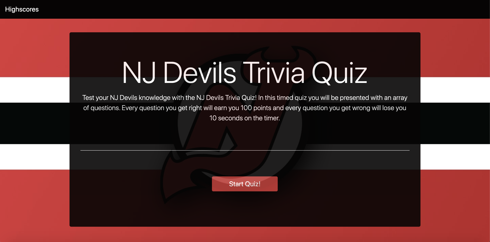
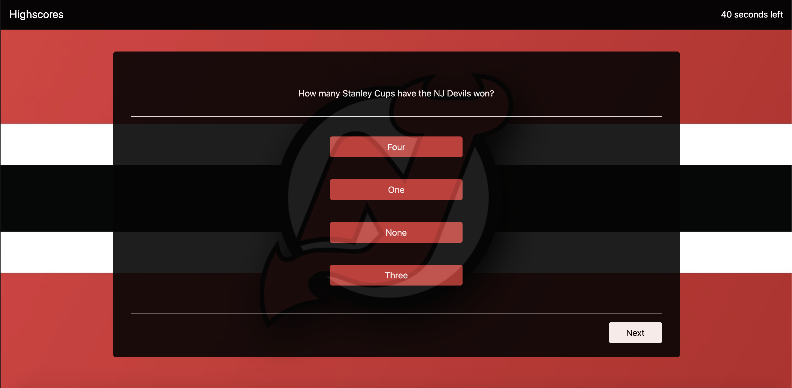
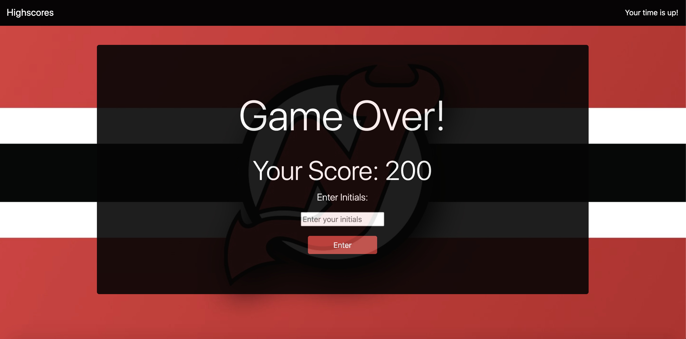
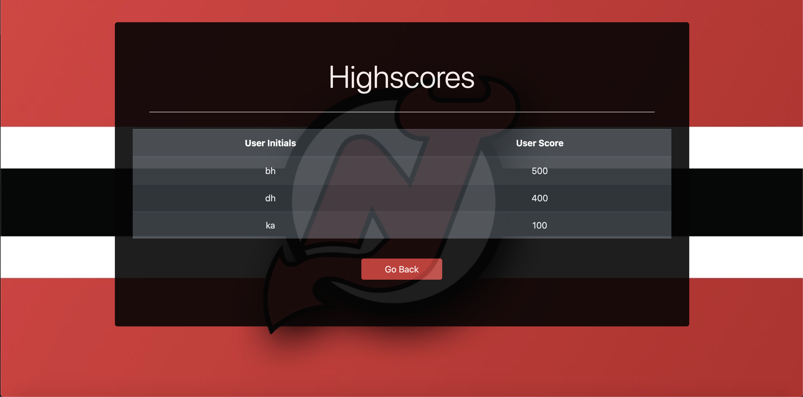

# NJ Devils Trivia Quiz

## Description

In this project my goal was to create a multiple choice quiz on JavaScript. This quiz will be timed and will store high scores. The application runs in the web browser displaying a clean, polished, and responsive user interface, made through utilizing HTML, CSS, and JS.

When the user clicks the start button the quiz's timer starts and they are presented with the first of five multiple choice questions. Once the user answers the question and presses "next" they will be presented with the next question. If they answer any questions wrong time will subtracted from the timer.

Once the timer reaches 0 or the user answers all the questions and presses "submit", whichever comes first, then the game is over.

After the game is over the user will be prompted to enter their initials to save their score in the high score library.

## Screenshots of Application  
The start page is where the user will read the directions and start the game.
  

Once the game is started the timer will start and user will be presented with their first question.
  

Once the timer ends or the user answers all the questions, they will be prompted to enter their initials.
  

After the user saves their initials, they will be located to the highscores page where they can see how they did compared to other players.
  

## License
This project is licensed under the MIT license.

## Contributing
To contribute to this project you can fork this GitHub repository.

## Questions
If you have any additional questions about this application you can reach out to me at briannahebeler@gmail.com.
You can check out some of my other projects at briannahebeler (https://github.com/briannahebeler).

## Link
https://briannahebeler.github.io/NJ-Devils-Trivia-Quiz/
